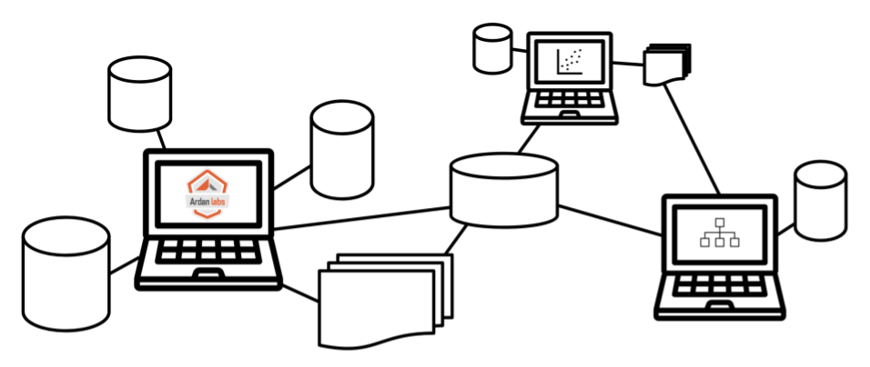

# AI Class/Training Materials

*Note: This material has been designed to be taught in a classroom/video environment. The code is well commented but missing some of the contextual concepts and ideas that will be covered in class.*

## Python-Based AI Workflows - From Notebook to Production Scale

This material is for intermediate-level data scientists, developers, data engineers, or researchers. Specifically, this material is for those who have some experience developing ML/AI models on sample data sets (maybe in Jupyter), but who might struggle to scale, deploy, and productionize their work. They need to understand which Python tools to use as they scale our workflows beyond the notebook, and they need to understand how to manage and distribute work on large data. 

[Python-based AI Workflows - From Notebook to Production Scale](notebook-to-production)

## Machine Learning with Go

This is material for any Go developer, data scientist, analyst, or statistician who wishes to learn how to build robust machine learning applications in Go. This class provides an intensive, comprehensive and idiomatic view on training, utilizing, evaluating, and deploying machine learning models using Go. We believe this class is perfect for anyone wishing to build data-driven applications that produce valuable insights, have reproducible behavior, and can be deployed within modern architectures.

[Machine Learning with Go](machine-learning-with-go)

## Deep Learning with Tensorflow or PyTorch

Coming soon...

## AI on Kubernetes

Coming soon...

___
All material is licensed under the [Apache License Version 2.0, January 2004](http://www.apache.org/licenses/LICENSE-2.0).
